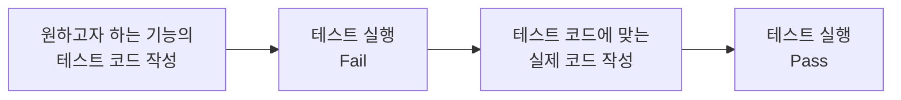

## TDD

- 테스트란 프로그램을 실행하여 오류와 결함을 검증하고 애플리케이션이 요구사항에 맞게 동작하는지 검증하는 절차이다

### TDD (Test Driven Development)

- 실제 코드를 작성하기 전에 테스트 코드를 먼저 작성한다
- 테스트 코드를 작성한 후 그 테스트 코드를 Pass 할 수 있는 실제 코드를 작성한다

**Static(정적) 테스트**

- TypeScript, Eslint 등으로 구문 오류나 스타일 등을 검증하며 가장 쉽게 테스트를 생성할 수 있다

**Unit(단위) 테스트**

- 단위 테스트는 개발자가 수행하고 자신이 개발한 코드 단위(일명 모듈, 구성요소)를 테스트 한다
- 소스 코드의 `개별 단위`를 테스트하여 사용할 준비가 되었는지 확인하는 테스트 방법이다
- 개별 라이프 사이클의 초기 단계에서 버그가 식별되므로 버그 수정 비용을 줄이는데 도움이 된다
- 간단히 생각하면 메소드를 테스트하는 또 다른 메소드라고 생각하면 된다
- *단위 테스트의 조건*
  - 독립적이어야 하며, 어떤 테스트도 다른 테스트에 의존하지 않아야 한다
  - 격리되어야 한다. Ajax, Axios, LocalStorage 등 테스트 대상이 의존하는 것을 다른 것으로 대체해야 한다

**Integration(통합) 테스트**

- 통합 테스트는 단위 테스트보다 큰 범위의 테스트를 의미하며 애플리케이션의 여러 부분들이 통합되어 제대로 상호작용 되는지 테스트 한다
  - 예를 들어, 단위 테스트는 하나의 함수를 테스트 한다면 통합 테스트는 함수를 테스트하는데 그 함수 안에 다른 함수를 호출하는 함수를 테스트해서 의존성이 있는 테스트를 하게 된다
- 구현 비용과 구현 시간을 고려했을 때 상대적으로 가장 효율이 좋고 가장 많이 작성하면 좋은 테스트이다
- ex. React Testing Library, Jest, Enzyme

**E2E 테스트**

- E2E 테스트는 `End to End 테스트`의 약자로 실제 사용자가 사용하는 것과 같은 조건에서 테스트를 진행하는 것을 말한다
- 회사에 QA팀이 있다면 QA팀에서 실제 사용자의 시나리오를 가지고 테스트하는 것처럼 애플리케이션의 동작을 테스트하게 된다
- ex. Cypress, Puppeteer
- E2E 테스트는 유닛 테스트나 통합 테스트와 비교했을 때 관리가 어렵고 속도가 느리고 수행 비용이 비싸기 때문에 정말 필요한 부분만 작성하는게 좋다
- 테스트를 작성할 때는 이 테스트가 필요한지와 이 테스트로 인한 비용을 고려하면서 작성하면 좋다

### TDD & BDD

**TDD (Test Driven Development)**
- 테스트 주도 개발
- 테스트 먼저 작성 후 테스트가 정상적으로 돌아갈 때까지 테스트하면서 코드를 작성

**BDD (Behavior Driven Development)**
- 행동 주도 개발
- 테스트를 똑같이 작성하지만 행동 주도 개발이라는 용어처럼 사용자의 행위를 생각하면서 테스트를 작성한다

TDD와 BDD는 완전히 다른 것이 아니며 BDD 자체가 TDD의 한 종류로 테스트 위주의 개발을 하지만 좀 더 사용자의 행동을 생각하며 테스트를 개발하는 것이 BDD이다.
 
실무에서 개발을 시작할 때 요구사항이나 기획서가 있는데 이에 맞춰서 테스트를 작성하게 되면 BDD가 된다.

|--|TDD|BDD|
|--|----|----|
|테스트 목적|기능 동작 검증|서비스 유저 시나리오 동작 검증|
|테스트 설계의 중심|모듈의 기능 중심|서비스 사용자 행위 중심|
|테스트 코드 설계 재료|개발자가 작성하는 모듈 사양 문서|서비스 기획자가 작성하는 서비스 기획서|

BDD와 TDD는 상호 배타적인 관계가 아닌 상호 보완적인 관계로,
 
모듈이나 API 등을 검증할 때는 TDD로 검증하고 BDD를 이용해서 시나리오를 검증하면 좋다.
 
이렇게 하면 TDD로 인해서 설계 단계에서 예외 사항들을 처리할 수 있으며 BDD를 이용해서 누락된 시나리오를 검증할 수 있게 된다.