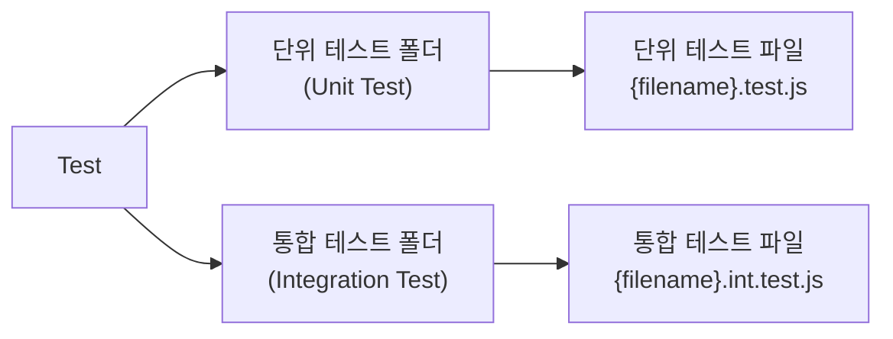
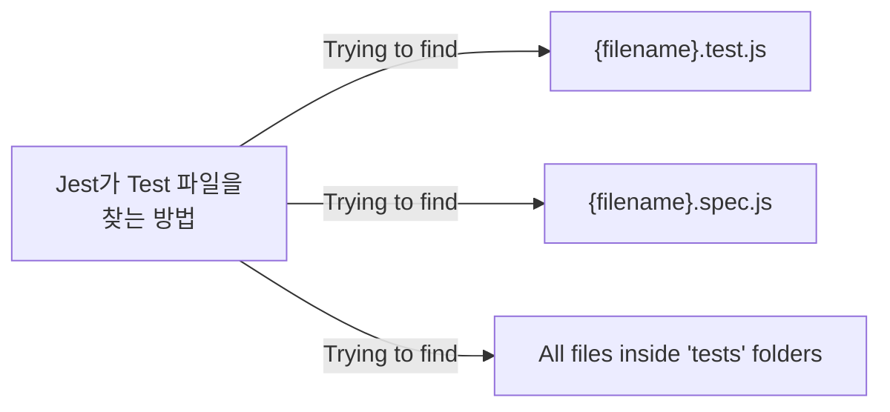

## Jest

- Facebook에 의해서 만들어진 테스팅 프레임워크
- 최소한의 설정으로 동작하며 Test Case를 만들어서 애플리케이션 코드가 잘 돌아가는지 확인해준다

### Jest setup

1. Jest 라이브러리 설치
```sh
$ npm install --save-dev jest
```

2. Test 스크립트 작성
```json
{
    "test": "jest",
    "test:watch": "jest --watchAll"
}
```

3. 테스트 작성할 폴더 및 파일 기본 구조 생성




### How to use

```js
describe("Product Controller create", () => {
    beforeEach(() => {
        req.body = newProduct;
    });

    it("should hvae a createProduct function", () => {
        // code
        expect().toBe();
    });

    it("should call Product.create", async () => {
        // code
        expect().toBeCalledWith();
    })

    it("should return 201 response code", async () => {
        // code
        expect().toBeTruthy();
    })
});
```

**"describe"**
<br/>

*argument (name, fn)*

- 여러 관련 테스트를 `그룹화`하는 블록을 만든다

**"it (test)"**
<br/>

*argument (name, fn, timeout)*

- `개별 테스트`를 수행하는 곳
- 각 테스트를 작은 문장처럼 설명한다

**"expect"**

- expect 함수는 값을 테스트할 때마다 사용된다
- expect 함수 혼자서는 거의 사용되지 않으며 `matcher`와 함께 사용된다

**"matcher"**

- `다른 방법`으로 값을 테스트하도록 "matcher"를 사용한다
- ex.
  - toBe()
  - toBeCalledWith()
  - toBeTruthy()

### jest.fn()

- `Mock 함수`를 생성하는 함수
- Mock의 한글 번역을 보면 "모의, 가짜, 흉내내는"의 뜻이 있다
- Mock 함수가 하는 일은 단위 테스트를 작성할 때, 해당 코드가 의존하는 부분을 가짜로 대체하는 일을 한다

**단위 테스트는 왜 독립적이어야 하는가?**

- 의존적인 부분을 구현하기가 까다로울 경우가 있으며,
- 의존적인 부분의 상태에 따라서 테스트하고자 하는 부분의 테스트 결과가 영향을 받을 수 있기 때문이다
- 가령 DB에 데이터를 저장하는 부분을 테스트한다고 하면...
  - 데이터를 전송하는 가운데 Network, I/O 작업, 트랜잭션 생성, 쿼리 전송 등에 영향을 받는다
  - 뿐만 아니라 테스트 종료 후, DB에서 변경 데이터를 직접 원복하거나 트랜잭션 rollback 해줘야 하는 등의 번거로운 작업들을 동반한다
  - 그저 DB에 데이터를 저장하는 부분을 테스트하기 위해서 너무나 많은 작업이 들어가게 되고 비효율적이다

**단위 테스트는 특정 기능만 분리해서 독립적으로 사용**

- `jest.fn()` 함수를 이용해서 가짜 함수를 생성 -> 의존적인 부분으로 인해 영향을 받는 테스트 상황을 해결
- jest.fn()이 생성한 가짜 함수는 이 함수에 어떤 일들이 발생했는지, 다른 코드들에 의해서 어떻게 호출되는지를 기억하기 때문에 이 함수가 내부적으로 어떻게 사용되는지도 검증할 수 있다 (Spy 역할)

```js
// Mock 함수 생성
const mockFunc = jest.fn();

mockFunc();
// 호출 인자를 넘겨서도 호출 가능
mockFunc('hello');

// Mock 함수가 어떤 결과값을 반환할지 설정 가능
mockFunc.mockReturnValue('Hello World!'); // mockReturnValue 메소드를 이용해 반환값 설정

// Mock 함수가 몇번 호출되었고 어떤 인자가 넘어왔는지 검증 가능
expect(mockFunc).toBeCalledWith('hello');
expect(mockFunc).toBeCalledTimes(3);
```

### jest.spyOn()

- `spyOn()` 메소드는 "spy"라는 용어에서 알 수 있듯이 어떠한 정보를 몰래 빼낼 때 사용한다
- jest.fn()에서는 함수의 구현을 가짜로 대체했지만 jest.spyOn()은 가짜로 대체하는 것이 아닌, 해당 함수의 호출 여부와 어떻게 호출되었는지를 알 수 있다
  - spy처럼 함수 호출을 추적할 수 있다

```js
const video = {
    play(name) {
        return `play ${name}`;
    },
};

it('plays video', () => {
    // jest.spyOn() 메소드를 이용해 video 객체의 play 함수에 spy를 붙인다
    const spyFn = jest.spyOn(video, 'play');
    const result = video.play('song name');

    // play 함수 호출 후, 호출 횟수와 어떤 인자값이 넘어갔는지 등을 추적할 수 있다
    expect(spyFn).toHaveBeenCalledTimes(1);
    expect(spyFn).toBeCalledWith('song name');
    // jest.fn()과 다르게 가짜 함수로 대체한 것이 아니기 때문에 결과값은 원래 구현대로 반환된다
    expect(result).toBeCalledWith('play song name');
});

```