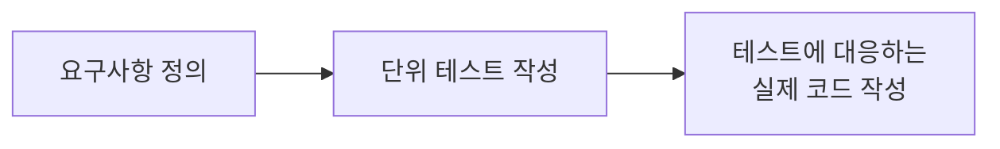

## TDD APP

### dependencies

- express "4.21.0"
- mongoose "8.6.3"
- jest "29.7.0" : 단위 테스트
- node-mocks-http "1.16.0" : 단위 테스트
- supertest "7.0.0" : 통합 테스트

```sh
$ npm i --save express mongoose
$ npm i --save-dev jest node-mocks-http supertest
```

### 작업 순서

