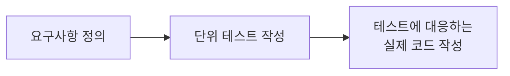

## TDD APP

### dependencies

- express "4.21.0"
- mongoose "8.6.3"
- jest "29.7.0" : 단위 테스트
- node-mocks-http "1.16.0" : 단위 테스트
- supertest "7.0.0" : 통합 테스트

```sh
$ npm i --save express mongoose
$ npm i --save-dev jest node-mocks-http supertest
```

### 작업 순서



### node-mocks-http

- 단위 테스트에서 request, response 객체를 얻기 위해 `node-mocks-http` 모듈 이용
- node-mocks-http 모듈을 이용해서 Express.js 애플리케이션 라우팅 함수를 테스트하기 위한 http 객체 (request, response)를 얻을 수 있다

```js
const req = httpMocks.createRequest();
const res = httpMocks.createResponse();
```