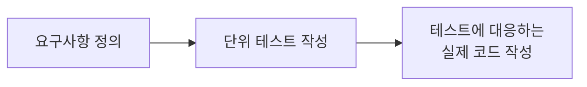

## TDD APP

### dependencies

- express "4.21.0"
- mongoose "8.6.3"
- jest "29.7.0" : 단위 테스트
- node-mocks-http "1.16.0" : 단위 테스트
- supertest "7.0.0" : 통합 테스트

```sh
$ npm i --save express mongoose
$ npm i --save-dev jest node-mocks-http supertest
```

### 작업 순서



### node-mocks-http

- 단위 테스트에서 request, response 객체를 얻기 위해 `node-mocks-http` 모듈 이용
- node-mocks-http 모듈을 이용해서 Express.js 애플리케이션 라우팅 함수를 테스트하기 위한 http 객체 (request, response)를 얻을 수 있다

```js
const req = httpMocks.createRequest();
const res = httpMocks.createResponse();
```

### supertest

- Node.js http 서버를 테스트하기 위해 만들어진 모듈
- supertest 모듈을 이용해서 통합 테스트를 쉽게 구현할 수 있다

**Integration 테스트**

- 통합 테스트는 모듈을 통합하는 단계에서 수행하는 테스트이다
- 단위 테스트를 먼저 수행하여 모듈들이 잘 작동되는 것을 확인했다면, 이제 이 모듈들을 연동하여 테스트를 수행하는 것

```js
const request = require('supertest');
const express = require('express');
const app = express();

// 원본 소스코드
app.get('/user', (req, res) => {
    res.status(200).json({ name: 'bitkunst' })
});

// 위의 원본 소스코드를 위한 통합 테스트 코드
request(app)
    .get('/user')
    .expect('Content-Type', '/json/')
    .expect('Content-Length', '15')
    .expect(200)
    .end((err, res) => {
        if (err) throw err;
    });
```